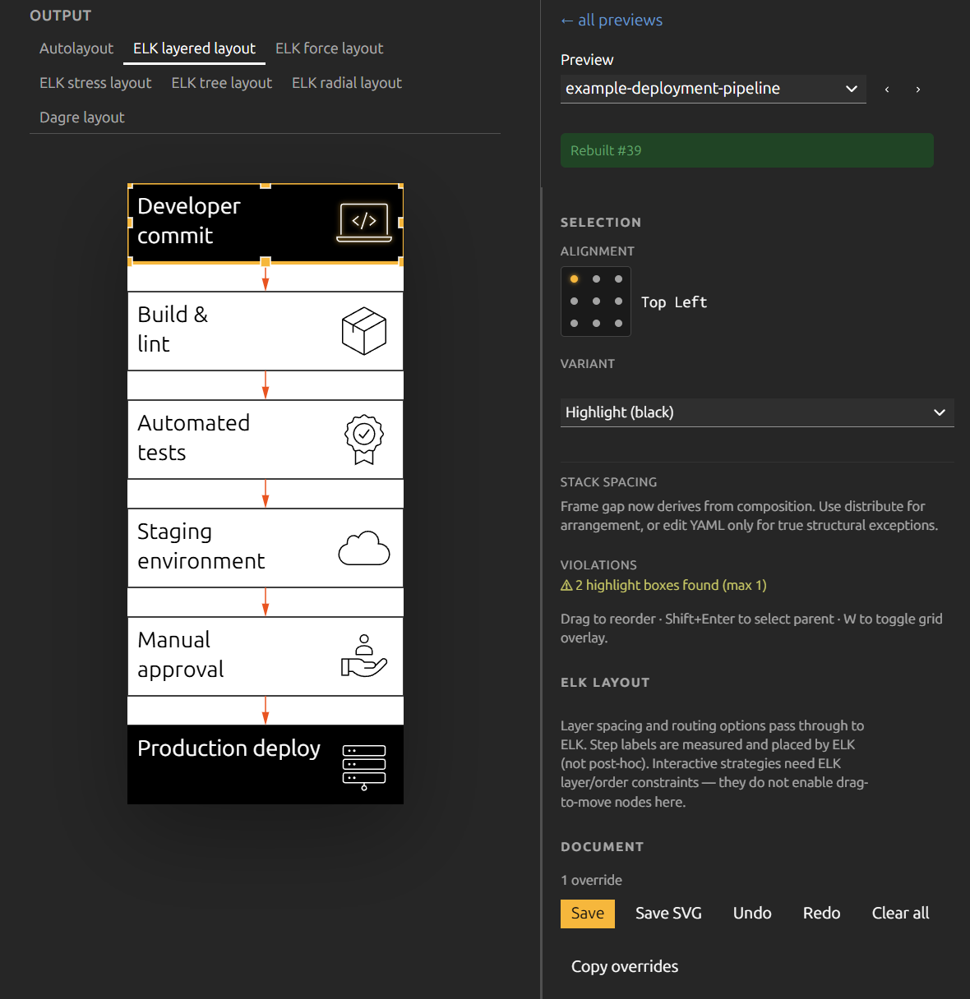
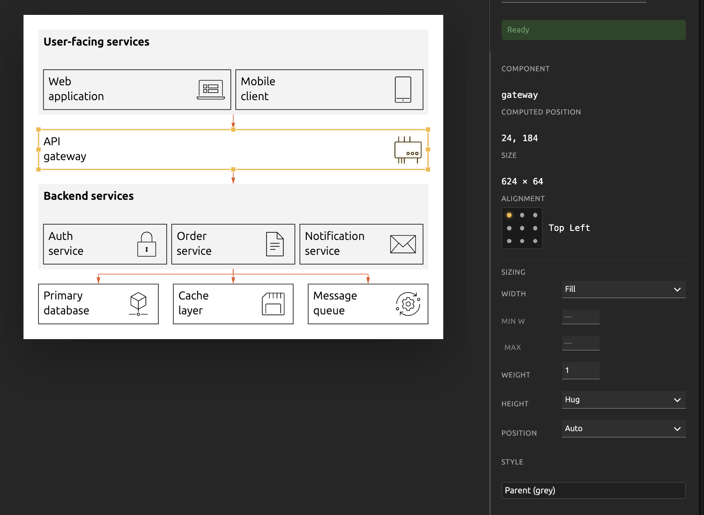

# Inbox

Drop notes here. The agent will triage items into the relevant spec package or
spec pointer, then empty this file back to its template header.

//claude opus - adversarial review - these were supposedly addressed, ca nyou pleasecheck
remove the following:
Engine: Native v3 autolayout<button type="button" class="bf-tabs-link" data-engine-id="elk-radial" role="tab" aria-selected="false" tabindex="-1">ELK radial layout</button>

remove margin-botom on tab buttons (check baseline-foundry, there should be a utility for that.) <button type="button" class="bf-tabs-link" data-engine-id="elk-radial" role="tab" aria-selected="false" tabindex="-1">ELK radial layout</button> -

on this example: http://127.0.0.1:8100/view/v3:juju-bootstrap-machines-process
clicking on any of these leeds to no change, so that regression is not yet fixed:
Native v3 autolayout
ELK layered layout
ELK force layout
ELK stress layout
ELK tree layout
ELK radial layout
ELK rectangle packing
Dagre layout

worse, when I modify node placement to network simplex, suddenly that switches to another exampke, where a lot of annotation labels on arrows get placed on top of one another; this is very broken and you twicxer tell me it isfixed; deep architectural sweep eon this pls to discover the real cause

http://127.0.0.1:8100/view/v3:mongo-octavia-ha  - very broken; 3xIPs , AZ1, AZ 2, AZ3, are listed underneath instead of next tothe 3 vm boxes, as was in the original design
 also when I switch to the native v3 autolayout (which we should rename to simply  "autolayout", make a note of that ) it still displays elk

this noteis pointless ,remove. the presence opr lack of tabs is enough to indicate that:
"Only engines compatible with this document are listed. Switching tabs rerenders the preview immediately and remains unsaved until you save."

remove this and associated code: "
Show ELK debug overlay
Overlay on styled view: dashed blue rects = node boxes, green = routes, amber = label bounds."

this should only be shown wwhen the engine is elk: "Show ELK raw view
Replaces BF styling with ELK’s default look: gray boxes, black orthogonal edges, ELK-placed labels."

when switching from autolayout to elk tab, overall page padding disappears. visible here http://127.0.0.1:8100/view/v3:mongo-octavia-ha

http://127.0.0.1:8100/view/v3:service-handshake-sequence doesnt respect the styling contract; different font sizes, different offset of text fro mthe top left corner of the box. annotations on arrows and outside are smaller font size; we should have a hardened instruction that only one font sizes is to be used. also, it is not possible to select elements and change them from their current appearance to any of the other approved box types.

on this, changing box type leads to relayout. this is wrong, only the appearance should change as box sizing doesnt change http://127.0.0.1:8100/view/v3:support-engineering-flow. this affects all elk layouts. also, in the ui, when certain parameters do not apply, like the layout grid cols/rows/gutters/margins etc, then they should be nidden not just disabled

resizing a parent should resize any children seet to hug. in this example  this doesnt work; by default, the child is set to fixed, when set to hug it doesnt resize to fit the smaller resized parent http://127.0.0.1:8100/view/v3:test-alignment-grid

we need to increase the spacing at the bottom of headings in section boxes - right now, they get too close to the child node. an 8px increase pls

certain boxes are still listed as "unknown variant" on load
http://127.0.0.1:8100/view/v3:test-deep-nesting

have we got rules to automatically decide how to style boxes? I remember instructing, but dont know if it made it intoo the code and rules
wrong:

correct:

if no nesting ->all are styed as children, or annotations on arrows.
if nexting - elements that are logically at the same level (judgement call the agent makes when writing the yaml), are styled at that appropriate level:
e.g. if 1 node has 3 2 levels of nexting, and 2 nodes have none but are on the level of the parent, they go to section styling; if 2 level nexting - they go to parent styling. so esentially the level of nesting determins what the highest level of node is (0-child, 1 - parent, 2 - section), and similar notes are autopromoted to that level. this is extremely important, write a detailed spec and see if the rules are clear enough both in code and md orskill files

 http://127.0.0.1:8100/view/v3:tiered-network-architecture - switching autolaout from horizontal to verticla breaks arrow placement - this used to work, refactor regression

changing box styling doesnt work any more - i select child/annotaiton/parent/section, nothing changes. investigate pls;

 all elk parameters gone even when on elk now

Local relayout failed on http://127.0.0.1:8100/view/v3:example-deployment-pipeline when I change the 9 dot alignment grid; it should not be present on elk; but all options elkjs provides should be surfaced on each elk node; you cheated - instead of contextually surfaceing what options exist for each layout, you simply hids all elk related options, neglected to remove all autolayout options that are not contextually relevant to elk, and interacting with them genertes errors.
