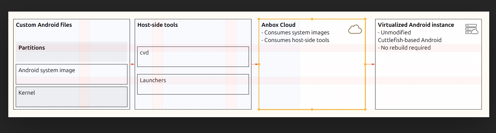
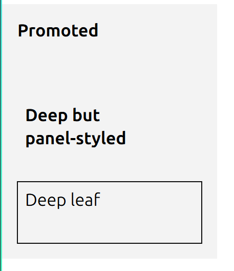

# Inbox

Drop notes here. The agent will triage items into `TODO.md` (near-term) or `ROADMAP.md` (longer-term), then empty this file back to its template header.

once I enter a text field, it is impossible to deselect it even when i select something else 

