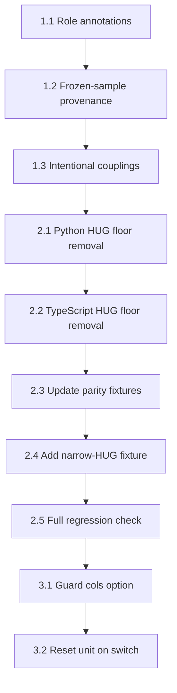

# Implementation plan – Spec 010: DIAGRAM.md token audit and sizing model correction

**Spec**: [specs/010-diagram-token-audit/spec.md](spec.md)
**Branch**: `feat/010-diagram-token-audit`
**Constitution**: Historical spec-kit template; the original `.specify` constitution is not retained in this repository.

---

## Technical context

### Codebase layout

| Surface | Path | Role |
|---------|------|------|
| Visual contract | `DIAGRAM.md` | YAML frontmatter defines all tokens; prose defines rules |
| Python tokens | `scripts/diagram_shared.py` | `BLOCK_WIDTH`, `BOX_MIN_HEIGHT`, `ICON_SIZE`, `INSET`, etc. |
| Python arrow tokens | `scripts/design_tokens.py` | `ARROW_HEAD_LENGTH`, `ARROW_HEAD_HALF_WIDTH`, `ARROW_CLEARANCE`, etc. |
| Python layout engine | `scripts/layout_v3.py` | Two-pass measure/place; line 291 has the `BLOCK_WIDTH` floor |
| TypeScript tokens | `packages/layout-engine/src/tokens.ts` | Mirror of Python tokens |
| TypeScript layout engine | `packages/layout-engine/src/layout.ts` | Faithful port of `layout_v3.py`; line 150 has the `BLOCK_WIDTH` floor |
| SVG renderer | `scripts/diagram_render_svg.py` | Consumes arrow tokens from `design_tokens.py` |
| Editor UI | `scripts/preview/editor.js` | Inspector sidebar; column-span already partially implemented |
| Frame class spec | `docs/frame-classes.md` | Four legal visual treatments |
| Parity tests | `scripts/test_parity.py` | Ensures Python and TS produce identical coordinates |
| Parity fixtures | `packages/layout-engine/tests/fixtures/parity-fixtures.json` | Shared fixture data |

### Key code paths affected

**HUG floor (the main bug)**:

Python (`layout_v3.py:291`):
```python
w = max(round_up_to_grid(content_w), BLOCK_WIDTH)
```

TypeScript (`layout.ts:150`):
```typescript
w = Math.max(roundUpToGrid(contentW), BLOCK_WIDTH);
```

Both enforce a 192px minimum on HUG-measured leaf width. The fix removes the `BLOCK_WIDTH` floor so HUG boxes shrink to `round_up_to_grid(content_w)`.

**Text wrapping default width**: Both engines also use `BLOCK_WIDTH` as the default `text_max_w` for initial wrapping estimates (Python line ~268, TS line ~108/117). This is correct – it sets the initial wrap width before the parent resolves the actual width. This should remain unchanged.

**Empty-box fallback**: Both engines fall back to `BLOCK_WIDTH` when a leaf has no text content (Python line 295, TS line 152). This is the "empty box" default and should remain unchanged.

### Production diagrams

24 production frame YAMLs (non-test) must be regression-checked after any sizing change:

`android-container-vs-vm`, `android-custom-to-cloud`, `android-graphics-stack`, `android-security-comparison`, `aws-hld`, `complex-routing-usecase`, `diagram-intake-workflow`, `diagram-language-workflow`, `example-deployment-pipeline`, `example-platform-architecture`, `example-stacked-blocks`, `gpu-waiting-scheduler`, `lightning-talk-engine`, `lt-a4-generator`, `lt-diagram-generator`, `lt-summit-identity`, `maas-architecture`, `maas-machine-lifecycle`, `maas-vendor-support`, `request-to-hardware-stack`, `rise-of-inference-economy`, `simple-testcase`, `support-engineering-flow`

Plus 7 test-prefixed YAMLs for the test suite.

### Column-span inspector status

The editor already has:
- `colSpanToPx()` / `pxToColSpan()` conversion functions
- A `px` / `cols` unit selector dropdown next to the width input
- `_inspectorWidthUnit` state tracking
- Both single-selection and multi-selection inspector paths

The "cols" option is always visible. The spec asks it to appear only when the diagram has explicit grid columns. This is a small conditional-display fix, not a new feature.

---

## Constitution check

| Principle | Status | Notes |
|-----------|--------|-------|
| I. Anti-patch protocol | PASS | Each change is classified below; no special-casing for individual diagrams |
| II. Layer ownership | PASS | Token changes go to `DIAGRAM.md` + token files; sizing logic goes to layout engines; UI goes to editor.js |
| III. DIAGRAM.md is the visual contract | PASS | Part 1 updates DIAGRAM.md first; engines then sync to it |
| IV. Test before ship | PASS | Parity tests + full production-diagram regression required at each part |
| V. Sensible defaults | PASS | This spec explicitly distinguishes invariants from defaults |
| VI. Stable public interfaces | PASS | No public function signatures change; only internal sizing behaviour |
| VII. No format lock-in | N/A | No new format identifiers |
| VIII. Semantic YAML | N/A | No YAML schema changes |

**Gate evaluation**: All gates pass. No violations.

---

## Phase 0: Research

### R1: Arrow token provenance

**Decision**: The values `10.8408px` and `2.9053px` are derived from a measured SVG arrowhead, not from deliberate design. However, `MIN_ARROW_SEGMENT = 16` is deliberately `ARROW_CLEARANCE + ceil(ARROW_HEAD_LENGTH)` snapped to the 8px grid. The head geometry is sample-derived but functionally stable – changing it would alter every arrow in every diagram.

**Rationale**: Replace the fractional values with clean, grid-aligned equivalents that produce visually identical arrowheads. Candidates: head length 11px (grid-snapped would be 12, but 11 keeps the head proportions), half-width 3px. Or keep as-is and document them as "frozen sample values." The safer choice is to document as frozen and defer redesign to a future spec.

**Alternatives**: (a) Round to nearest integer (11, 3) – marginally changes every arrowhead. (b) Round to grid (16, 8) – visibly different. (c) Keep as-is, document provenance. *Chosen: (c).*

### R2: `terminal-bar.height = 64px` vs `BOX_MIN_HEIGHT = 64px`

**Decision**: Coincidence, not intentional coupling. `terminal-bar.height` is the full height of the terminal chrome bar component; `BOX_MIN_HEIGHT` is `ICON_SIZE + 2*INSET`. They happen to equal 64px but for unrelated reasons.

**Rationale**: Document them independently. `terminal-bar.height` should reference its own rationale (chrome height + content area), not `BOX_MIN_HEIGHT`.

### R3: `chromeHeight: 20px`

**Decision**: This is the height of the title-bar chrome strip inside a terminal-bar component. It comes from the original terminal-bar SVG sample. The value has no upstream design-system source.

**Rationale**: Document as a component-specific constant. It's not a design token – it's a component dimension.

### R4: `matrix-widget.size = 48px` vs `ICON_SIZE = 48px`

**Decision**: Intentional – the matrix widget cell is icon-sized by design, so matrix cells and icons align in the same grid rhythm.

**Rationale**: Document the intentional coupling. `matrix-widget.size` should reference `icon-size`.

### R5: Column-span conditional display

**Decision**: The `cols` option in the width inspector should only appear when `gridInfo` is available and has valid `col_widths`. This is a simple guard already half-present in `pxToColSpan()` (which returns `null` when `gridInfo` is missing).

**Rationale**: Extend the guard to the UI rendering path – don't emit the `cols` `<option>` element when `gridInfo?.col_widths` is falsy.

---

## Phase 1: Design

### Data model

No new entities. The change is a reclassification of existing token values.

#### Token classification schema

Each DIAGRAM.md frontmatter value gets one of three roles:

| Role | Meaning | Engine behaviour |
|------|---------|-----------------|
| **invariant** | Deliberate design decision; enforced by the engine | Hard constant; change requires spec amendment |
| **default** | Reasonable starting point; overridable per-diagram or per-frame | Used when no explicit value is provided; never used as a floor/clamp |
| **frozen-sample** | Measured from initial sample; kept for stability | Treated as invariant until deliberately redesigned |

#### Token audit table

| Token | Current value | Classification | Action |
|-------|--------------|----------------|--------|
| `baseline-unit` | 8px | invariant | No change |
| `grid-gutter` | 24px | invariant | No change |
| `outer-margin` | 24px | invariant | No change |
| `icon-size` | 48px | invariant | No change |
| `inset` | 8px | invariant | No change |
| `default-box-width` | 192px | **default** | Reclassify; remove as HUG floor |
| `default-box-min-height` | 64px | invariant | Keep – it's `ICON_SIZE + 2*INSET`, ensures row rhythm |
| `growthStep` | 8px | invariant | Same as `baseline-unit`; document the alias |
| `arrowHeadLength` | 10.8408px | frozen-sample | Document provenance; keep value |
| `arrowHeadHalfWidth` | 2.9053px | frozen-sample | Document provenance; keep value |
| `arrowClearance` | 8px | invariant | No change |
| `minArrowSegment` | 16px | invariant | Derived: `arrowClearance + ceil(arrowHeadLength)` on 8px grid |
| `arrowExitClearance` | 8px | invariant | No change |
| `arrowGap` | 24px | invariant | Derived: `minArrowSegment + arrowExitClearance` |
| `terminal-bar.height` | 64px | frozen-sample | Document as component dimension, not linked to `BOX_MIN_HEIGHT` |
| `chromeHeight` | 20px | frozen-sample | Document as component dimension |
| `matrix-widget.size` | 48px | invariant | Document intentional coupling to `icon-size` |
| `box-default.width` | 192px | **default** | Same as `default-box-width`; annotate |
| `box-accent.width` | 192px | **default** | Same as `default-box-width`; annotate |
| `box-emphasis.width` | 192px | **default** | Same as `default-box-width`; annotate |

### Contracts

#### C1: HUG sizing contract (updated)

```
GIVEN a leaf frame with sizing_w = HUG
AND the leaf has text content
WHEN the engine measures width
THEN width = round_up_to_grid(padding_left + text_width + padding_right + icon_column)
AND there is NO minimum floor from BLOCK_WIDTH
AND the value is grid-snapped via round_up_to_grid()
```

#### C2: Default width contract (unchanged, made explicit)

```
GIVEN a leaf frame with no explicit width
AND no text content
WHEN the engine measures width
THEN width = BLOCK_WIDTH (192px)
```

#### C3: Text wrapping default (unchanged, made explicit)

```
GIVEN a leaf frame with no explicit width and no constrained width from parent
WHEN estimating text_max_w for initial wrapping
THEN text_max_w = BLOCK_WIDTH - padding_left - padding_right - icon_column
```

#### C4: Column-span display contract

```
GIVEN the inspector renders the width input for a FIXED-width frame
WHEN gridInfo is available AND gridInfo.col_widths has entries
THEN the unit selector shows both "px" and "cols" options
WHEN gridInfo is NOT available OR gridInfo.col_widths is empty
THEN the unit selector shows only "px"
AND _inspectorWidthUnit is reset to 'px' if it was 'cols'
```

---

## Phase 2: Implementation tasks

### Part 1: DIAGRAM.md token audit [S]

**Classification**: Configuration – updating metadata annotations, no logic changes.

#### Task 1.1: Add role annotations to DIAGRAM.md frontmatter

Update the YAML frontmatter in `DIAGRAM.md` to add a `role:` field or inline comment for each token, using the classification from the audit table above. Group tokens by role where natural.

**Files**: `DIAGRAM.md`
**Validation**: YAML frontmatter parses cleanly; no engine behaviour change.

#### Task 1.2: Document frozen-sample provenance

Add a `notes:` field to `arrowHeadLength`, `arrowHeadHalfWidth`, `terminal-bar.height`, and `chromeHeight` explaining they were measured from initial sample SVGs and are kept for stability.

**Files**: `DIAGRAM.md`
**Validation**: Same as 1.1.

#### Task 1.3: Document intentional couplings

Add `notes:` to `matrix-widget.size` referencing `icon-size`. Add `notes:` to `default-box-min-height` explaining `ICON_SIZE + 2*INSET`. Document that `growthStep` is an alias for `baseline-unit`.

**Files**: `DIAGRAM.md`
**Validation**: Same as 1.1.

---

### Part 2: Fix HUG sizing model [H]

**Classification**: Contract change – modifying a layout invariant.

**Anti-patch check**:
1. Am I adding a special case for one diagram? No – this applies to all HUG leaves.
2. Am I touching a file with an existing workaround? No.
3. Am I duplicating logic? No – changing in both engines symmetrically.
4. Would this break if I changed the triggering diagram? No – it's a general rule.
5. Is this fix at the owning layer? Yes – layout engines own sizing.

#### Task 2.1: Remove BLOCK_WIDTH floor from Python HUG measurement

In `scripts/layout_v3.py`, function `_measure_leaf()`, change:

```python
# Before
w = max(round_up_to_grid(content_w), BLOCK_WIDTH)

# After
w = round_up_to_grid(content_w)
```

The empty-box fallback (`w = BLOCK_WIDTH` in the `else` branch) remains.

**Files**: `scripts/layout_v3.py`
**Validation**: `python -m pytest test_frame_loader.py test_autolayout.py test_layout_v3.py -q`

#### Task 2.2: Remove BLOCK_WIDTH floor from TypeScript HUG measurement

In `packages/layout-engine/src/layout.ts`, function `measureLeaf()`, change:

```typescript
// Before
w = Math.max(roundUpToGrid(contentW), BLOCK_WIDTH);

// After
w = roundUpToGrid(contentW);
```

**Files**: `packages/layout-engine/src/layout.ts`
**Validation**: `cd packages/layout-engine && npm test`

#### Task 2.3: Update parity fixtures

Existing parity fixtures that test HUG-sized leaves with narrow text may produce different widths after the floor removal. Update `parity-fixtures.json` expected values to match the new (correct) behaviour.

**Files**: `packages/layout-engine/tests/fixtures/parity-fixtures.json`
**Validation**: `python -m pytest test_parity.py -q` + TS parity tests

#### Task 2.4: Add targeted parity test for narrow HUG leaf

Add a fixture to `parity-fixtures.json` that specifically tests a HUG leaf with short text (content width < 192px) and verifies the width is `round_up_to_grid(content_w)`, not clamped to 192.

**Files**: `packages/layout-engine/tests/fixtures/parity-fixtures.json`
**Validation**: Both Python and TS parity tests pass.

#### Task 2.5: Full production regression check

Render all 24 production diagrams and browser-verify at `http://127.0.0.1:8100/view/v3:<slug>`. Some diagrams may visually change (narrower annotation boxes, tighter HUG leaves). Each visual change must be reviewed and confirmed as correct – a narrower annotation is the intended outcome.

**Files**: None (verification only)
**Validation**: Visual inspection of all 24 slugs. Screenshot before/after for any that visually change.

---

### Part 3: Column-span conditional display [S]

**Classification**: Feature – small UI enhancement composing with existing primitives.

#### Task 3.1: Guard column-span option on grid availability

In `scripts/preview/editor.js`, in both the single-selection and multi-selection inspector paths, wrap the `cols` `<option>` element in a conditional that checks `gridInfo && gridInfo.col_widths && gridInfo.col_widths.length > 0`.

Reset `_inspectorWidthUnit` to `'px'` when switching to a diagram that has no grid columns.

**Files**: `scripts/preview/editor.js`
**Validation**: Browser-verify: (a) diagram with explicit grid columns shows both px/cols options; (b) diagram without grid columns shows only px.

#### Task 3.2: Reset unit on diagram switch

When the user switches between diagrams (the `loadDiagram()` or equivalent path), if the new diagram has no grid, reset `_inspectorWidthUnit = 'px'` to avoid stale column-span state from the previous diagram.

**Files**: `scripts/preview/editor.js`
**Validation**: Switch from a gridded diagram to a non-gridded one; confirm the width input shows px, not cols.

---

## Execution order and dependencies



Part 1 (token audit) is pure documentation and can be done first without risk. Part 2 (HUG fix) is the core contract change and must be done in Python-first, TS-second lockstep with parity tests between each step. Part 3 (column-span UI) is independent but sequenced last to avoid context-switching.

---

## Validation checklist

- [ ] DIAGRAM.md frontmatter parses; all tokens annotated with role
- [ ] `python -m pytest test_frame_loader.py test_autolayout.py test_layout_v3.py test_parity.py -q` passes
- [ ] TypeScript tests pass (`cd packages/layout-engine && npm test`)
- [ ] All 24 production diagrams render without error
- [ ] Visual regression reviewed for any diagrams that change width
- [ ] Column-span option conditional on grid presence
- [ ] Unit resets when switching to non-gridded diagram

---

## Risk register

| Risk | Likelihood | Impact | Mitigation |
|------|-----------|--------|------------|
| Removing HUG floor causes diagrams to look wrong (too narrow) | Medium | Medium | Visual review of all 24 diagrams; any that look wrong likely had content that relied on the floor as a design crutch – fix with explicit `width:` in the YAML |
| Parity fixtures need many updates | Low | Low | Fixtures are machine-generated; bulk-update is mechanical |
| Frozen arrow tokens cause confusion later | Low | Low | Clear `notes:` documentation in DIAGRAM.md explains provenance |
