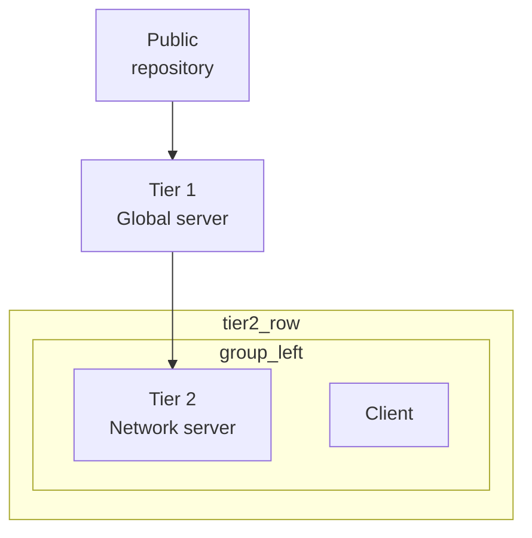

# Contract: Migration from verbose frame YAML to additive sugar

## Before (current canonical form)

```yaml
engine: v3
title: Tiered network architecture
arrows:
  - source: public_repo
    target: global_server
  - source: global_server
    target: tier2_left
root:
  id: page
  direction: vertical
  padding: 24
  align: top-center
  children:
    - id: public_repo
      label:
        - Public
        - repository
      icon: Cloud.svg
      sizing_w: fill
    - id: tier2_row
      direction: horizontal
      children:
        - id: group_left
          direction: vertical
          children:
            - id: tier2_left
              label:
                - Tier 2
                - Network server
              icon: Network.svg
            - id: client_l1
              label: Client
              icon: Laptop.svg
```

## After (same canonical top-level shape, less repetition)

```yaml
engine: v3
schema: author-v1
title: Tiered network architecture

defaults:
  client:
    label: Client
    icon: Laptop.svg
  network_server:
    label: [Tier 2, Network server]
    icon: Network.svg

arrows:
  - public_repo -> global_server
  - global_server -> tier2_left

root:
  id: page
  direction: vertical
  padding: 24
  align: top-center
  children:
    - id: public_repo
      label: [Public, repository]
      icon: Cloud.svg
      sizing_w: fill
    - id: tier2_row
      direction: horizontal
      children:
        - id: group_left
          direction: vertical
          children:
            - id: tier2_left
              use: network_server
            - id: client_l1
              use: client
```

## Mechanical mapping rules

| Current | Additive-sugar form |
|--------|----------------------|
| arrow object with only `source` / `target` | shorthand `source -> target` |
| repeated label/icon pairs | extract to `defaults` + `use:` |
| verbose line arrays | keep or compress where safe |
| `root` | unchanged |
| `arrows` | unchanged |

## Compatibility mode (no file rewrite)

Compiler accepts both **Before** and **After** unchanged:

1. object-form and shorthand arrows normalize to the same AST
2. `root` remains the canonical structural source
3. `defaults` expand before validation/lower
4. lowering produces equivalent `FrameDiagram`
5. SVG output should match pre-migration golden where semantics are unchanged

## Optional migration utility (T081)

```bash
node packages/layout-engine/scripts/migrate-diagram-yaml.mjs \
  --in scripts/diagrams/frames/tiered-network-architecture.yaml \
  --out scripts/diagrams/frames/tiered-network-architecture.author-v1.yaml \
  --shorthand-arrows --extract-defaults
```

Flags:

- `--in-place` — rewrite file (use with caution)
- `--extract-defaults` — heuristic template extraction from repeated frame entries
- `--shorthand-arrows` — convert eligible arrow objects to shorthand

At least one of `--extract-defaults` or `--shorthand-arrows` is required.

## Expected Mermaid export shape (informative)

From normalized AST of **After** document:



Exact formatting is golden-tested in T063; whitespace may differ.
