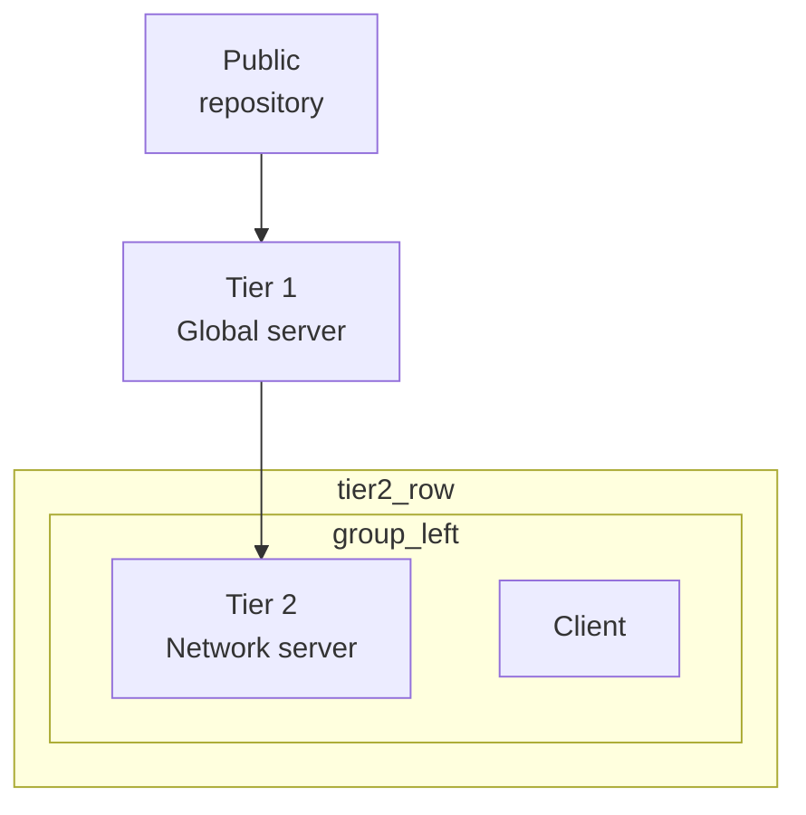

# Contract: Migration from legacy frame YAML

## Before (legacy)

```yaml
engine: v3
title: Tiered network architecture
arrows:
  - source: public_repo
    target: global_server
  - source: global_server
    target: tier2_left
root:
  id: page
  direction: vertical
  padding: 24
  align: top-center
  children:
    - id: public_repo
      label:
        - Public
        - repository
      icon: Cloud.svg
      sizing_w: fill
    - id: tier2_row
      direction: horizontal
      children:
        - id: group_left
          direction: vertical
          children:
            - id: tier2_left
              label:
                - Tier 2
                - Network server
              icon: Network.svg
            - id: client_l1
              label: Client
              icon: Laptop.svg
```

## After (author-v1)

```yaml
engine: v3
schema: author-v1
title: Tiered network architecture

edges:
  - public_repo -> global_server
  - global_server -> tier2_left

defaults:
  client:
    label: Client
    icon: Laptop.svg
  network_server:
    label: [Tier 2, Network server]
    icon: Network.svg

layout:
  direction: vertical
  padding: 24
  align: top-center
  children:
    - node: public_repo
      label: [Public, repository]
      icon: Cloud.svg
      sizing_w: fill

    - group: tier2_row
      direction: horizontal
      children:
        - group: group_left
          direction: vertical
          children:
            - node: tier2_left
              use: network_server
            - node: client_l1
              use: client
```

## Mechanical mapping rules

| Legacy | New |
|--------|-----|
| `arrows` | `edges` (shorthand where no extra props) |
| `root` | `layout` (root id `page` may be omitted or preserved in AST metadata) |
| `children[].id` + leaf props | `- node: <id>` |
| `children[].id` + `children` | `- group: <id>` |
| Repeated label/icon pairs | extract to `defaults` + `use:` |

## Compatibility mode (no file rewrite)

Compiler accepts **Before** unchanged:

1. `normalizeLegacySchema` maps `arrows` → `edges`, `root` → `layout`
2. Infers `node` vs `group` from presence of nested `children`
3. Emits deprecation diagnostics; lowering produces equivalent `FrameDiagram`
4. SVG output should match pre-migration golden (acceptance gate T052)

## Optional migration utility (T081)

```bash
node packages/layout-engine/scripts/migrate-diagram-yaml.mjs \
  --in scripts/diagrams/frames/tiered-network-architecture.yaml \
  --out scripts/diagrams/frames/tiered-network-architecture.author-v1.yaml
```

Flags:

- `--in-place` — rewrite file (use with caution)
- `--extract-defaults` — heuristic template extraction from repeated subtrees

## Expected Mermaid export shape (informative)

From normalized AST of **After** document:



Exact formatting is golden-tested in T063; whitespace may differ.
